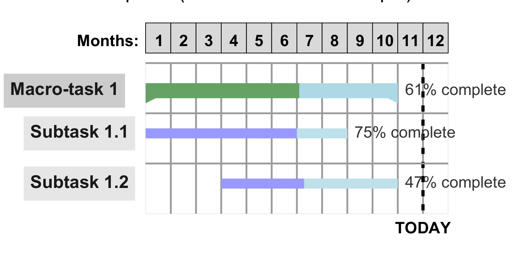

### PhDBiorobReportTemplate

This is a very simple LaTeX template for the annual report of the Bioengineering and Robotics PhD progam from University of Genova, equivalent to the Word one provided [here](https://biorob.phd.unige.it/docforms).

You can inspect a precompiled pdf example by going into the subfolder ```docs/example_empty/phd_biorob_report_template_example.pdf```.

Main package dependencies: 
- To mimic the original Word template, the package uses ```Arial``` font. However this is a Windows font which is not normally available on Linux distributions. If working with linux, install it with `sudo apt-get install ttf-mscorefonts-installer`. Also, to be able to generate a document with Arial, you need compile you document using either XeLaTeX or LuaLaTex. For example, if using TeXstudio editor, you can set this by going to ```Options/Configure Texstudio/Build/``` and changing the ```Default Compiler``` with one supporting Arial.
- The provided Gantt chart example uses the package [pgfgantt](https://ctan.org/pkg/pgfgantt):

    <div style="text-align:center">
        
    </div>  

    On Linux, if you installed LaTeX with ```sudo apt-get install texlive-full```, pgfgantt is available by default.